# **Operating System Lab 2 Manual**

> 

**Session: 2022 – 2026**

> **Submitted by:**
>
> Asim Ali Murtaza 2022-CS-175
>
> **Supervised by:**
>
> Mr. Nauman Shafi
>
> Department of Computer Science

## 			

> ## **University of Engineering and Technology**
>
> **Lahore Pakistan**


# Table of Content

[TOC]


#### **Task 1:**

**Ubuntu Installation on Virtual Box and Installing Compilers:**

##### **Step 1:**

Add Ubuntu ISO image to Virtual Box. The VM will power up automatically and the following booting screen will show.

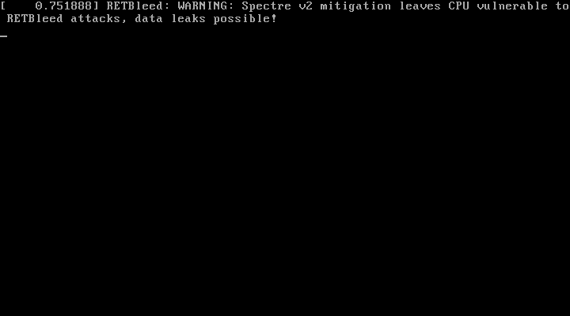

##### **Step 2:**

After that, The ubuntu will start.

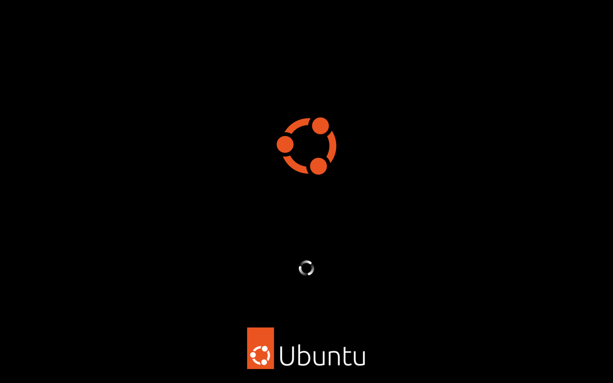

##### **Step 3:**

Then the screen will show up.

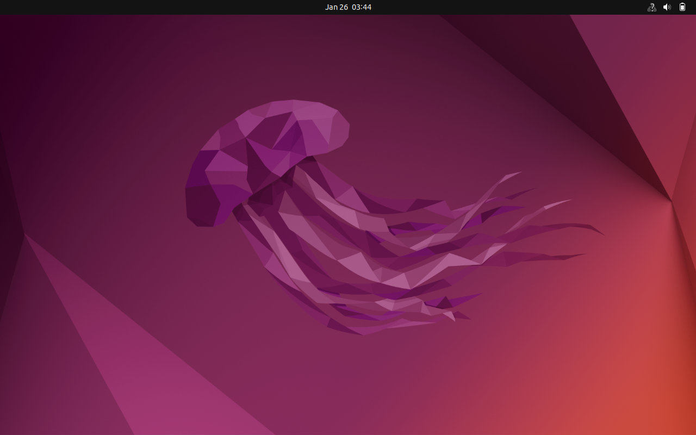

##### **Step 4:**

Here select your language and click on install Ubuntu.

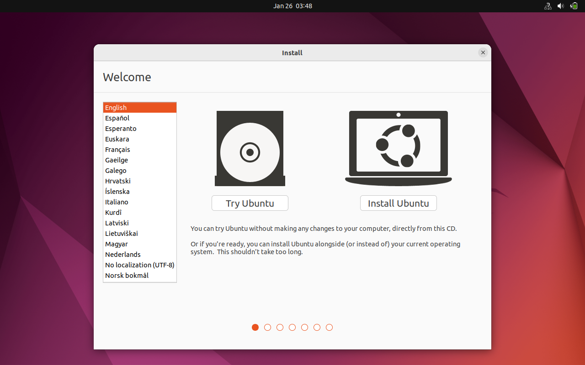

##### **Step 5:**

Here select your language and keyboard layout. Then click continue.

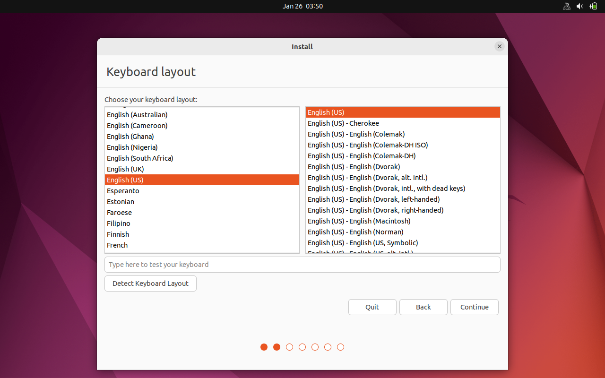

##### **Step 6:**

In this step, choose normal installation and click continue.

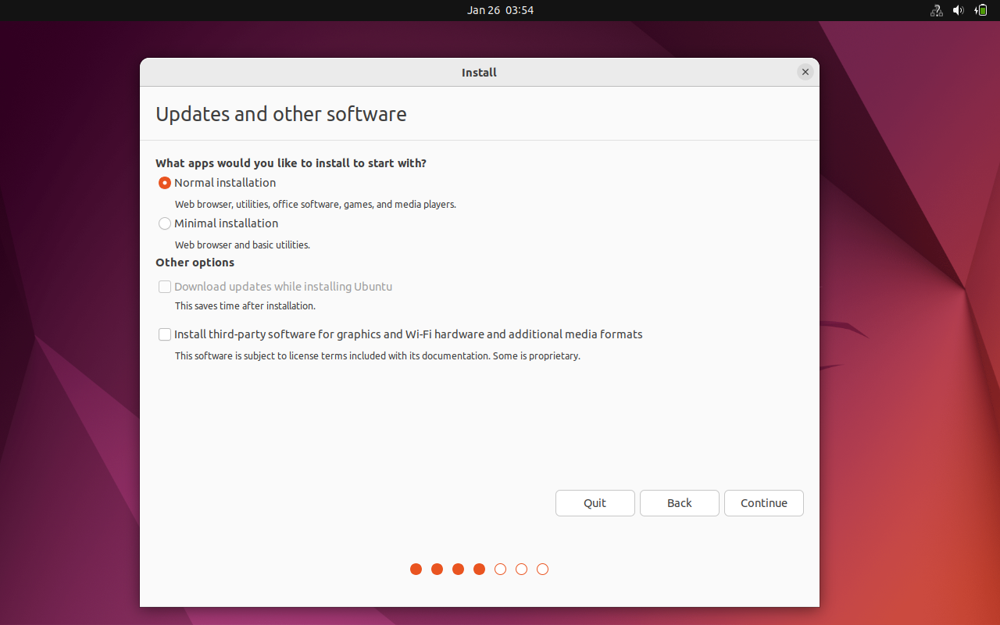

##### **Step 7:**

Select erase disk and install Ubuntu. Then click install now.

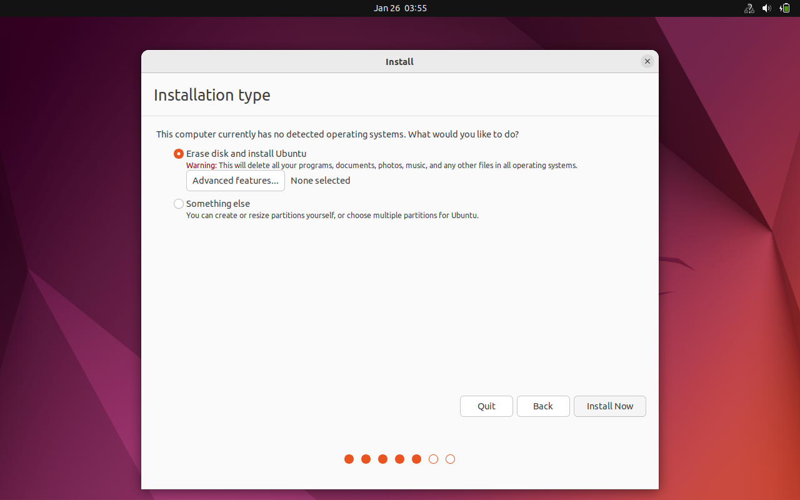

##### **Step 8:**

Choose your username, machine’s name, and password for your login account. Click continue.

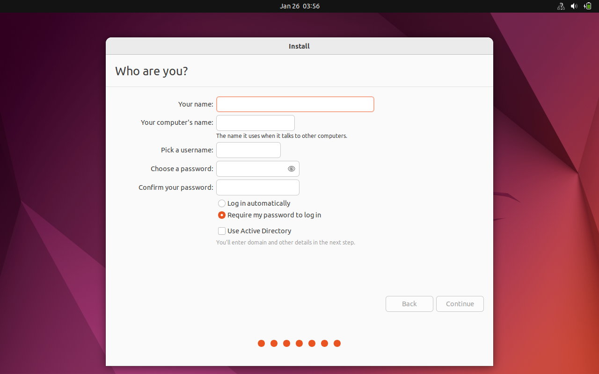

##### **Step 9:**

Now just wait for the installation to finish. It will take around 20-30 minutes depending on your allocated resources.

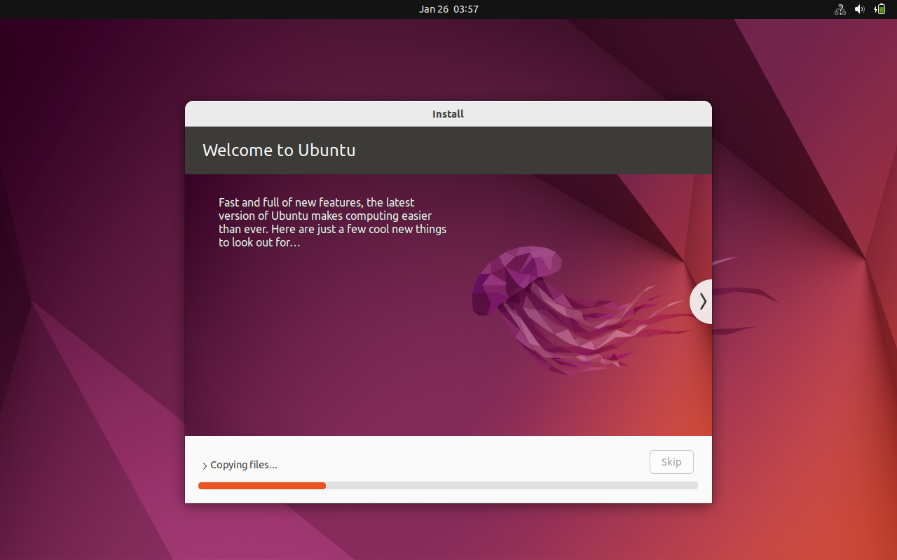

##### **Step 10:**

After installation is finished. It will ask to restart the computer. Click restart now and let it reboot.

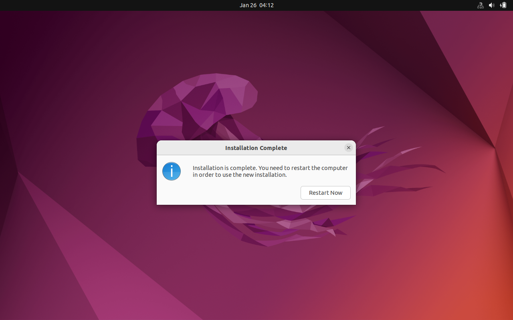

##### **Step 11:**

Now after rebooting, it will ask you to enter your password that you chose earlier. Enter your password and press the enter key.

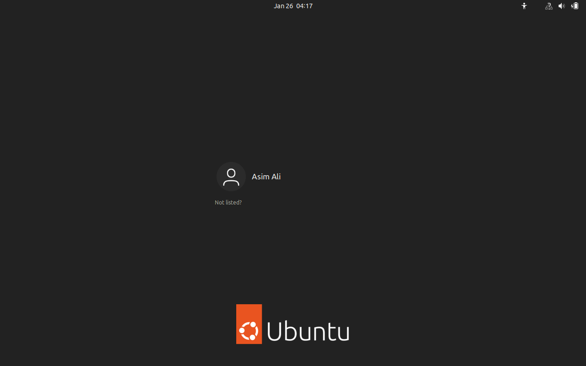

##### **Step 12:**

Congratulation! You have successfully installed Ubuntu on your Virtual Box.

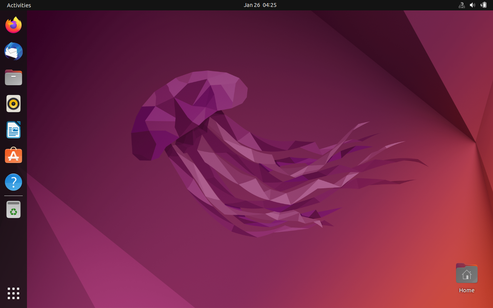

##### **Step 13:**

Open Terminal on your newly installed Ubuntu. A Terminal window will appear.


##### **Step 14:**

Install GCC compiler by typing the command "sudo apt install gcc". 

You will be prompted to continue to download the gcc. Type y and press enter key. The gcc compiler will begin downloading and installing. After successfully installing it, type gcc --version to check if it is installed properly.

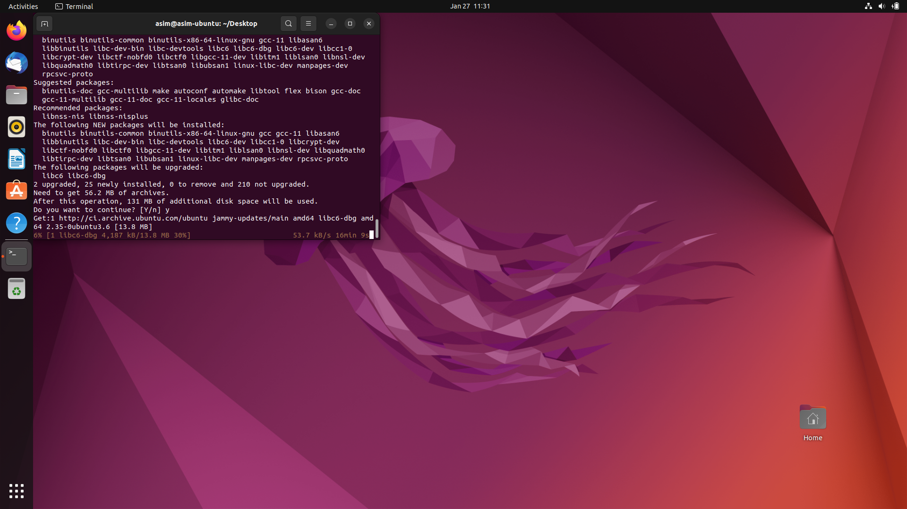

##### **Step 15:**

Install G++ compiler by typing the command "sudo apt install g++". 

You will be prompted to continue to download the g++. Type y and press enter key. The g++ compiler will begin downloading and installing in the same fashion as gcc. After successfully installing it, type g++--version to check if it is installed properly.

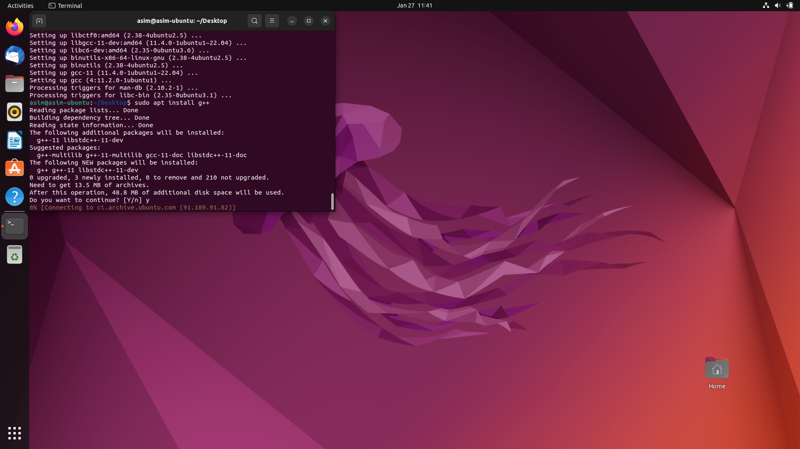


#### **Task 2:**

**Testing of GCC and G++ Compilers on Ubuntu:**

##### **Step 1:**

Open any code editor of your choice and create a file named "test.cpp", and enter the following code in it.

```c++
#include <iostream>

using namespace std;

int main(){

	cout << "Testing G++ Compiler!!!" << endl;

	return 0;

}
```

##### **Step 2:**

Now go to your terminal and compile your written code using the following commands:

g++ -o obj test.cpp

Then run it

./obj

and confirm the output.

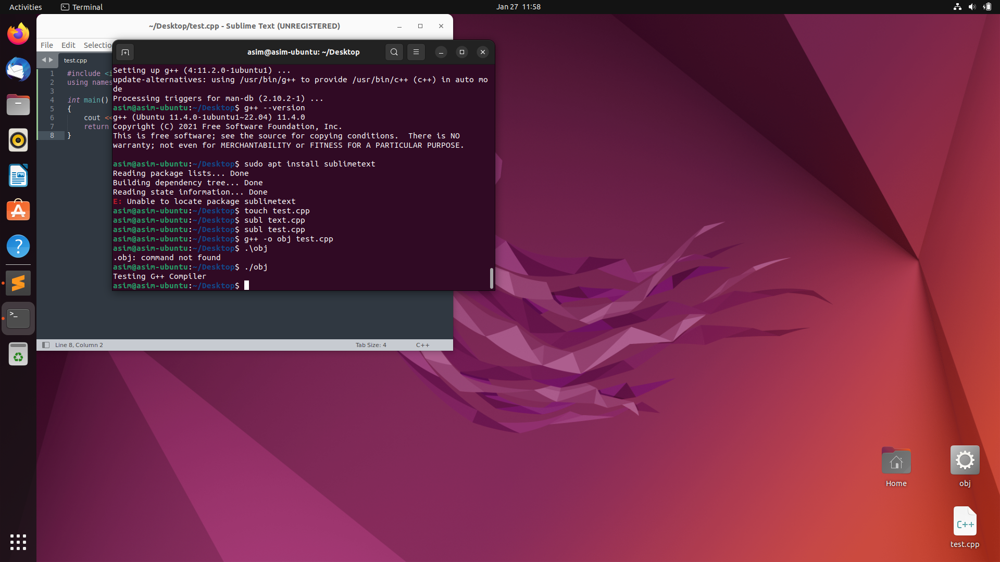

##### **Step 3:**

Now create another file named "test.c", and enter the following code in it.

```c
#include <stdio.h>

void main(){

	printf("Testing gcc Compiler!!!!!\n");

}
```

##### **Step 4:**

Now go to your terminal and compile your written code using the following commands:

gcc -o obj test.c

Then run it

./obj

and confirm the output.

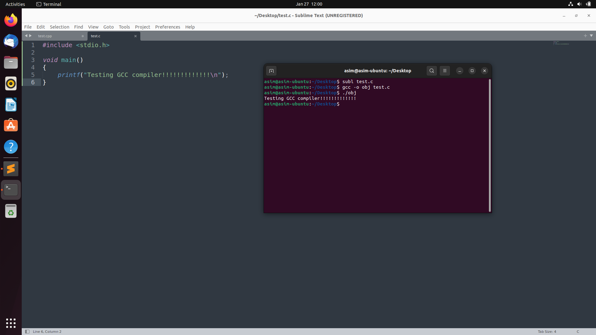

That's it! You have successfully installed and tested both compilers.


**GitHub Repository Link**

https://github.com/AsimAliMurtaza/Operating-Systems-Lab
