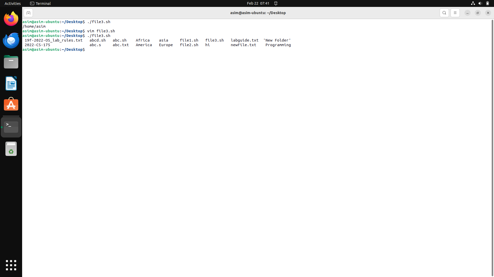

# **Operating System Lab 3 Manual**

> 

**Session: 2022 – 2026**

> **Submitted by:**
>
> Asim Ali Murtaza 2022-CS-175
>
> **Supervised by:**
>
> Mr. Nauman Shafi
>
> Department of Computer Science

## 			

> ## **University of Engineering and Technology**
>
> **Lahore Pakistan**

# Table of Content

[TOC]

#### **Task 1:**

**You are required to help a new Linux user.
Mr. Tom is new Ubuntu user. He wants guidance regarding shell scripting to perform following tasks:**

##### **Step 1:**

Create a simple script which will take two command line arguments and then multiply them together.

Declare 2 variables using let keyword, use read keyword to get input from the user and echo the resulting expression. 

##### **Step 2:**

Create a simple script, which will ask the user for a few pieces of information then combine this into a message which is echo'd to the screen.

Declare 3 variables, use read keyword to get input from the user and echo the variables. 

##### **Step 3:**

Now Mr. Tom suddenly lost the track of his current location. Help him find his location.

Use $HOME keyword with echo to display Current Working Directory.

##### **Step 4:**

Now he wants the list of all files present on home directory.

Insert ls in the script and execute.

##### **Step 5:**

Display the current time.

Insert date cmd in the script and execute.

##### **Step 6:**

He is done with the task and he is happy with your work. He want to display a thankyou message.

Simply echo the message in the script file and execute.

#### **Task 2:**

##### **Step 1:**

Write a simple shell script that uses arithmetic operators (+, -,*) using double parenthesis with printing your own roll # with the results of operations.

Declare variables for different operators and then echo the results of the operations and execute the file.

##### **Step 2:**

Write a simple shell script that uses all relational operators with printing your own roll # with the results of operations.

Declare variables for different relational operations and then echo the results of the operations and execute the file.

**GitHub Repository Link**

https://github.com/AsimAliMurtaza/Operating-Systems-Lab
