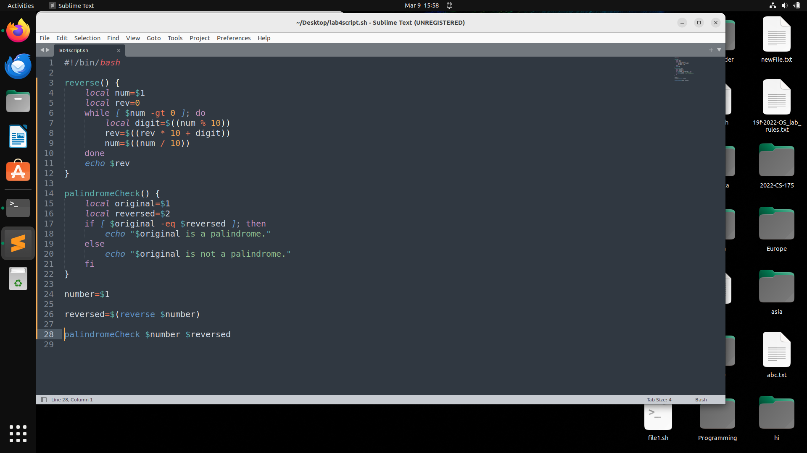

# **Operating System Lab 4 Manual**

> 

**Session: 2022 – 2026**

> **Submitted by:**
>
> Asim Ali Murtaza 2022-CS-175
>
> **Supervised by:**
>
> Mr. Nauman Shafi
>
> Department of Computer Science

## 			

> ## **University of Engineering and Technology**
>
> **Lahore Pakistan**

# Table of Content

[TOC]

### Task 1 (Decisions)

1. **Find the Largest Number:**
   - Create a Bash script that takes 3 numbers as command line arguments.
   - Implement logic to determine and print the largest of the three numbers.
   - Utilize conditional statements to compare the numbers and determine the largest.

   
   
   
   
2. **Print Message Based on Day of the Week:**
   - Develop a Bash script that prints a message based on the current day of the week.
   - Utilize a switch statement to determine the day of the week and print a corresponding message.
   - Include different messages for each day of the week using case statements.
   
   
   
   

### Task 2 (Loops)

1. **Print Numbers with Even/Odd Labels:**
   - Craft a simple script that prints numbers from 1 to 10, each on a separate line.
   - Include logic to determine whether each number is even or odd.
   - Print each number along with its corresponding label (even or odd) on separate lines.

   
   
   
   
2. **Calculate Sum of Digits:**
   - Write a program that reads a number as input and calculates the summation of all its digits.
   - Implement logic to extract each digit, calculate the sum, and return the result.
   - Provide an example with input and expected output to demonstrate the functionality.
   
   
   
   

### Task 3 (Functions)

1. **Check for Palindrome:**
   - Develop a shell script that takes a positive integer as an argument and checks if it's a palindrome.
   - Implement a function named `reverse()` to compute the reverse of the number.
   - Pass the number and its reverse to another function called `palindromeCheck()` to compare and determine if it's a palindrome.
   
   
   
   
   
2. **Compute Factorial using Recursion:**
   - Write a shell script that reads a number from the user and passes it to a function named `factorial()`.
   - Implement the `factorial()` function to find the factorial of the number using recursion.
   - Print the factorial on the terminal as the final output.

**GitHub Repository Link**

https://github.com/AsimAliMurtaza/Operating-Systems-Lab
