# **Operating System Lab 3 Manual**

> 

**Session: 2022 – 2026**

> **Submitted by:**
>
> Asim Ali Murtaza 2022-CS-175
>
> **Supervised by:**
>
> Mr. Nauman Shafi
>
> Department of Computer Science

## 			

> ## **University of Engineering and Technology**
>
> **Lahore Pakistan**

# Table of Content

[TOC]

#### **Task 1:**

**You are required to help a new Ubuntu user in performing Ubuntu commands.
Mr. Tom is new Ubuntu user. He want guidance regarding basic Ubuntu utilities to
perform following tasks**

##### **Step 1:**

User touch command to create a file named “19f-XXXX.txt”. Use nano "filename.txt" and insert 10 lines.

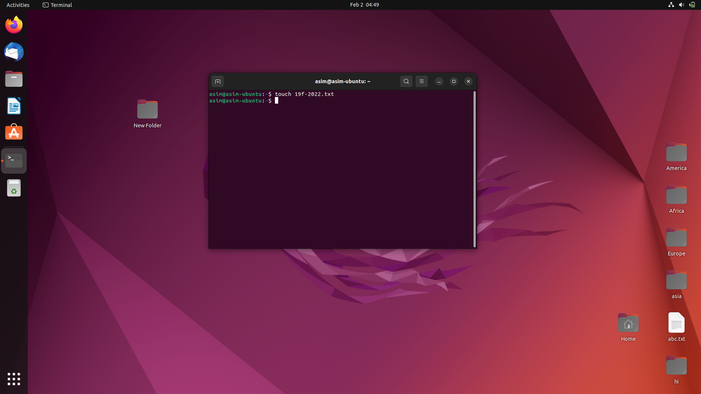

##### **Step 2:**

Use touch command and created another file named “asim_ali.txt”. Use nano "filename.txt" and insert 10 lines.

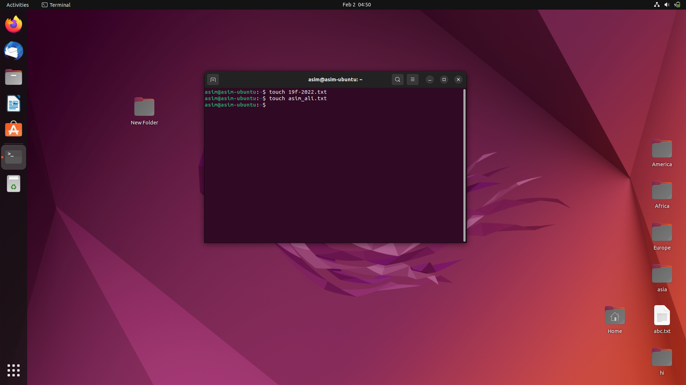

##### **Step 3:**

Use cat command to merge the data of both files and use >> operator to redirect the output to a new file.

##### **Step 4:**

Use head -n 2 to display the first two lines of first file.

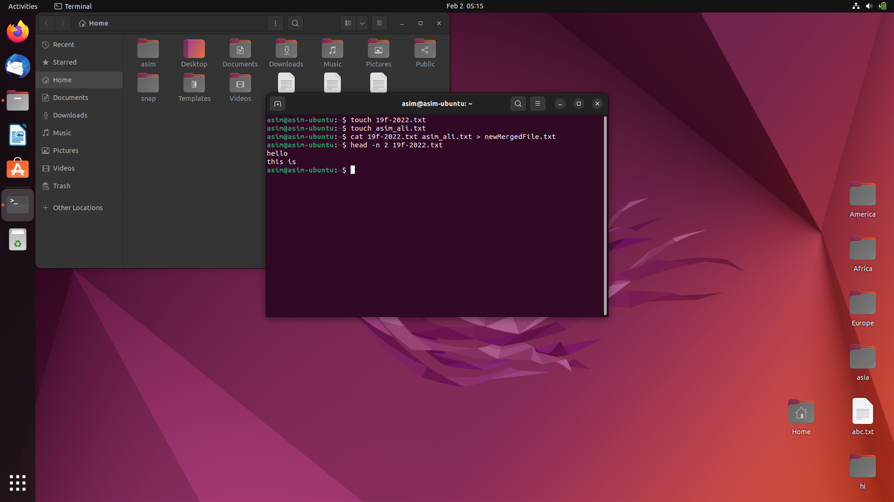

##### **Step 5:**

Use tail -n 2 to display the last two lines of second file.

##### **Step 6:**

Use grep "string" "filename.txt" to find the string (in this case, my roll number) from the first file.

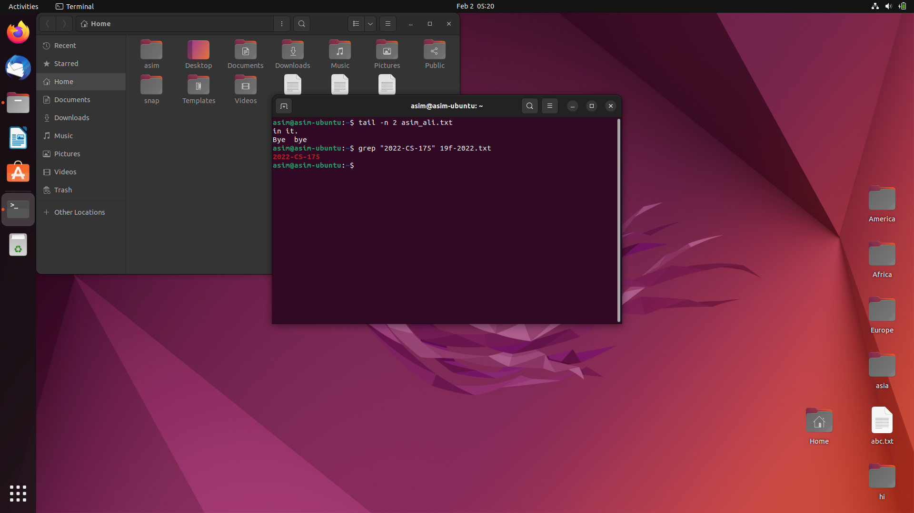

##### **Step 7:**

Use chmod value "filename.txt" to grant the execute permission of the second file to the group.

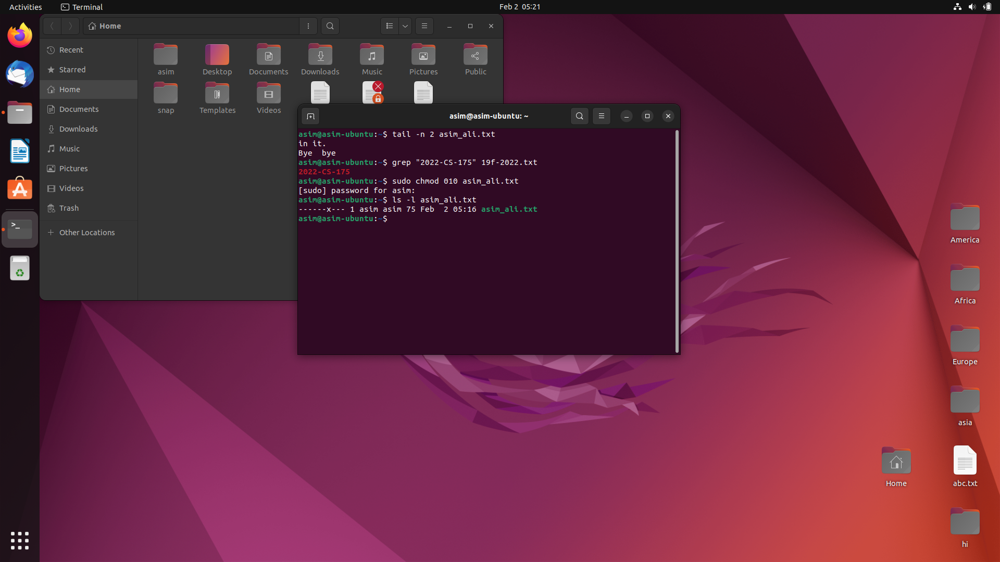

##### **Step 8:**

Use chmod command with 5 value (read = 4, write= 0, exec= 1) for User attrib to remove the write permission for the owner

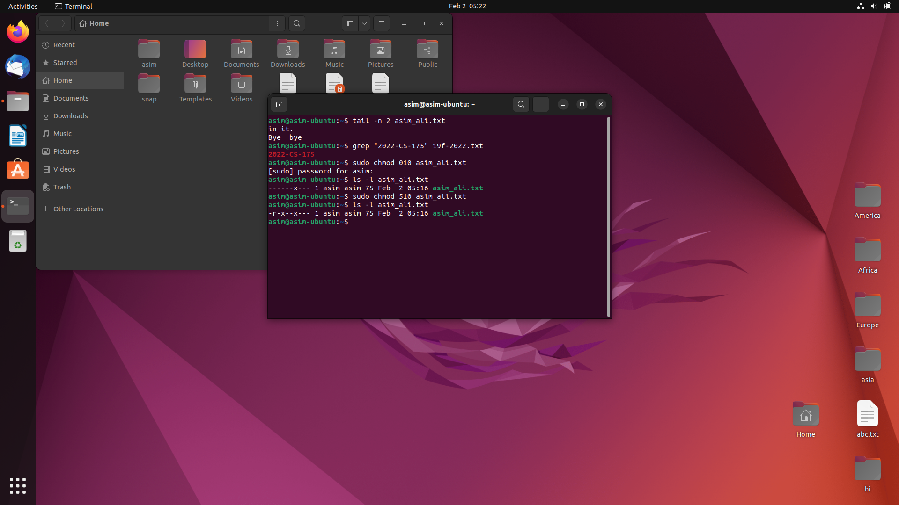

##### **Step 9:**

Now ise pwd command to show current location/directory.

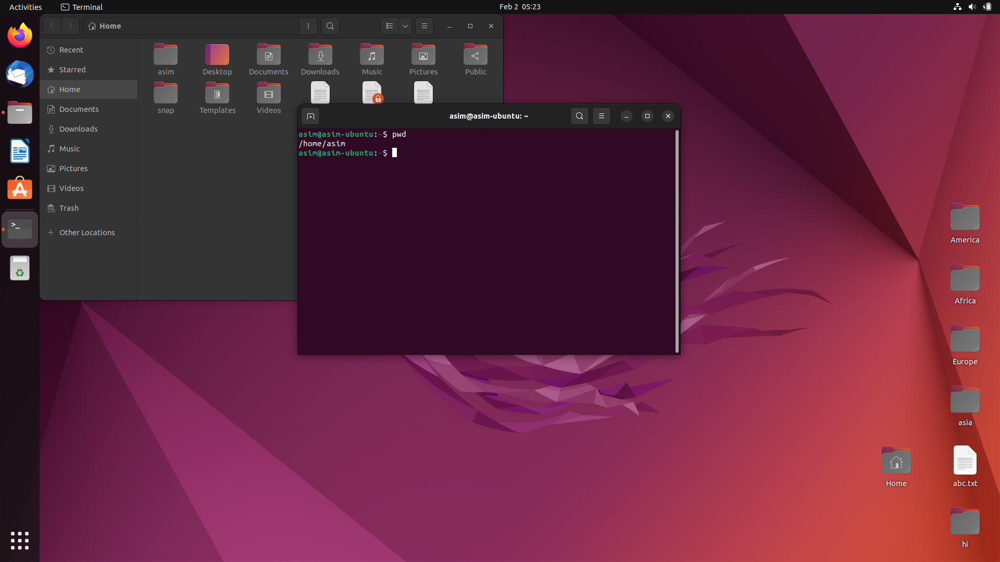

##### **Step 10:**

Go to Desktop and use ls command to list of all files present on Desktop directory.

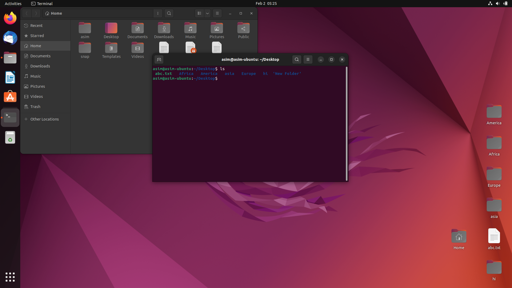

##### **Step 11:**

Now use mkdir command to create a folder of personal files and pictures named as
your 2022-CS-175.

##### **Step 12:**

Use date command to display the current time.

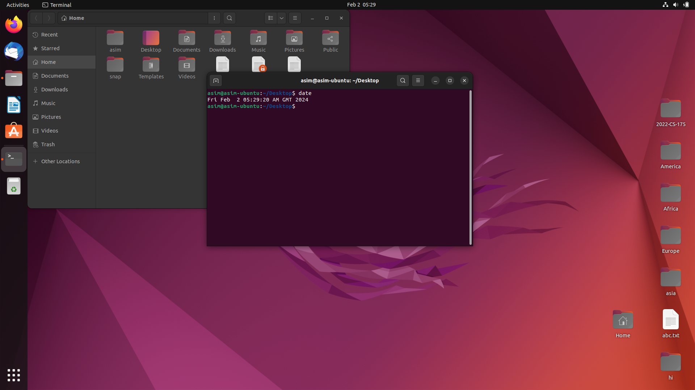

##### **Step 13:**

Use echo command to display a thank you message.

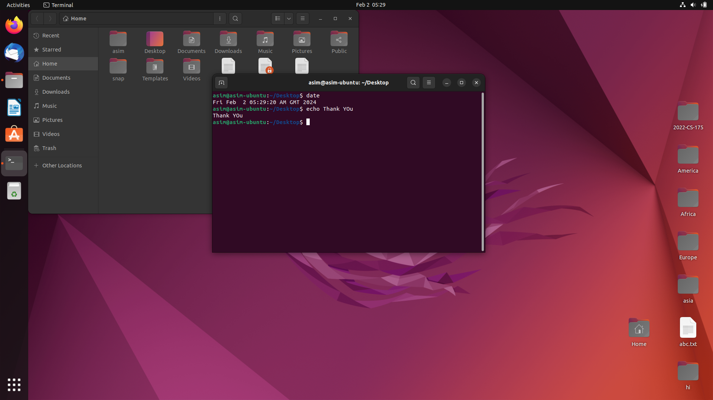

#### **Task 2:**

##### **Step 1:**

Use touch command and create a file named “19f-2022_OS-lab_rules.txt”.
Then insert all the rules of Lab from Week One Lab.

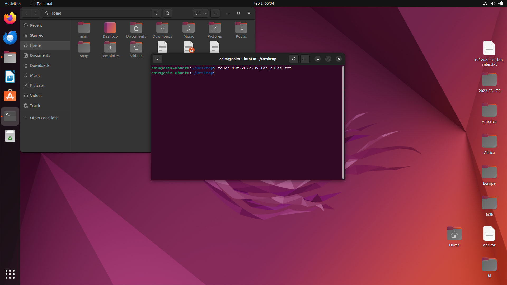

##### **Step 2:**

To set the file permissions to (-rwxr-xr--), you need to convert the given rights into the numeric format using the binary number system. Each permission set in the permissions triplet (-rwxr-xr--) corresponds to a binary digit (bit).

The permissions are divided into three parts: 

owner, group, and others.

- Owner: -rwx (read, write, execute)
- Group: r-x (read, execute)
- Others: r-- (read)

In the binary system:

- Read is represented by 4 (2^2)
- Write is represented by 2 (2^1)
- Execute is represented by 1 (2^0)

Owner: 4 (read) + 2 (write) + 1 (execute) = 7 Group: 4 (read) + 0 (no write) + 1 (execute) = 5 Others: 4 (read) + 0 (no write) + 0 (no execute) = 4

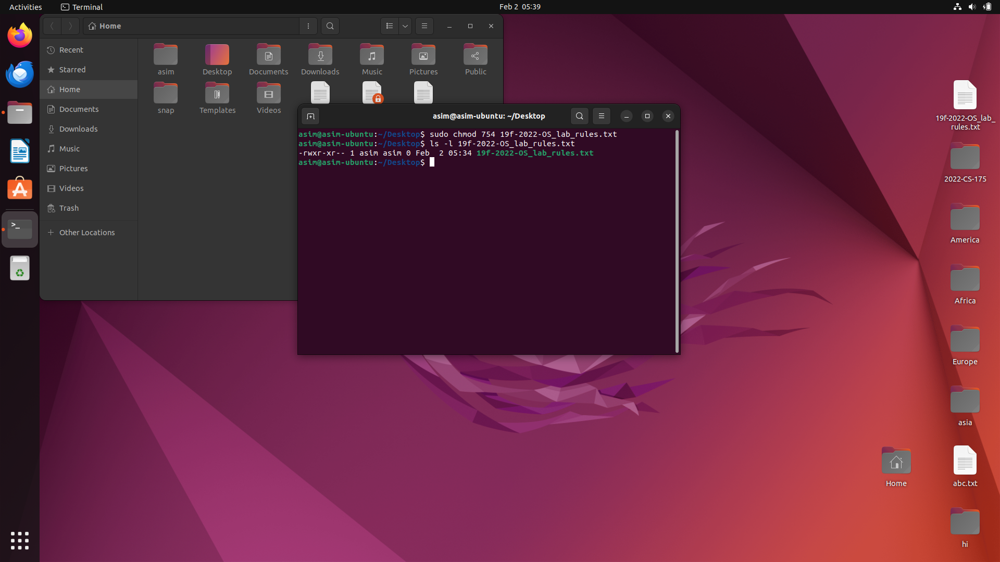

##### **Step 3:**

Use ls command with >> operator to append the output to a created file.

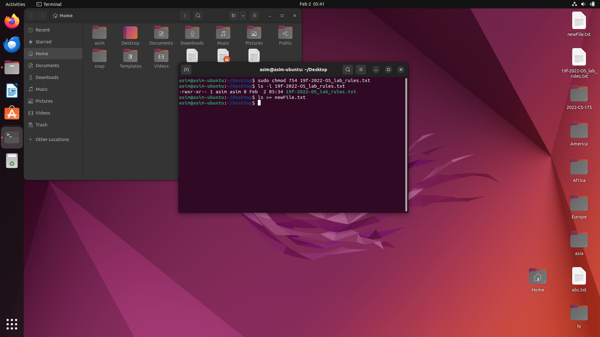

**GitHub Repository Link**

https://github.com/AsimAliMurtaza/Operating-Systems-Lab
